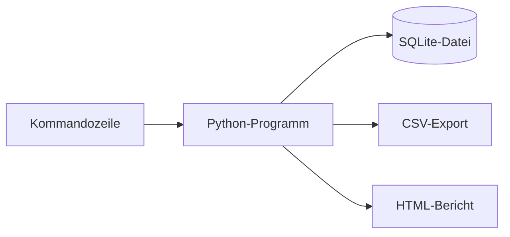

# Mein Bewerbungsmanager

Dieses kleine Python-Projekt habe ich gebaut, um Bewerbungen lokal zu verwalten und dabei Python und SQLite zu üben.


## Funktionen

- Bewerbung hinzufügen
- Einträge anzeigen und suchen
- Status ändern
- Einträge löschen
- CSV-Datei oder einfachen HTML-Bericht erstellen

Das Programm verschickt keine Bewerbungen. Alle Daten bleiben in einer lokalen SQLite-Datei.

## Aufbau



## Starten

Python 3.10 oder neuer reicht aus. Zusätzliche Pakete werden nicht benötigt.

```powershell
python -m bewerbungsmanager init
python -m bewerbungsmanager demo
python -m bewerbungsmanager list
```

Unter Windows kann man für die Demo auch `START_DEMO.bat` öffnen.

## Testen

```powershell
python -m unittest discover -s tests -v
```

## Was ich dabei gelernt habe

Ich habe bei diesem Projekt den Umgang mit Python-Modulen, SQLite, Kommandozeilen-Befehlen und einfachen Tests geübt. Außerdem habe ich gelernt, Daten als CSV und HTML auszugeben.

Die mitgelieferten Demo-Einträge sind erfunden. Eigene Datenbankdateien gehören nicht in GitHub.
